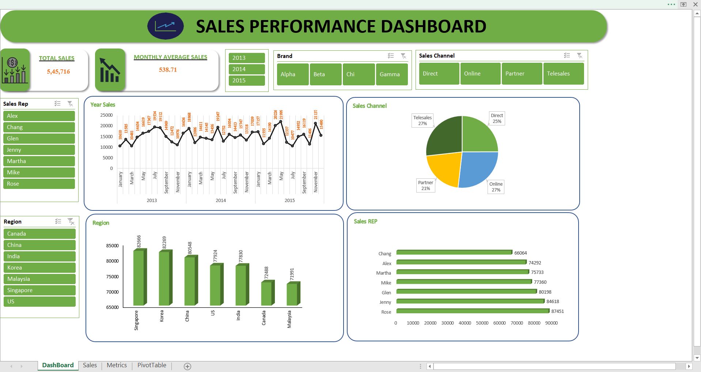

# Sales Performance Dashboard
An interactive sales dashboard created in Excel to visualize sales trends, top performers, and regional performance.

## Features
- Interactive slicers for filtering data
- Line charts for Year wise sales
- Bar and column charts for comparisons
- Key metrics summary (Total Sales, Top Sales Rep, etc.)

## How to Use
- Download the `Sales_Dashboard.xlsx` file.
- Open it in Excel to explore the interactive dashboard.
- Screenshot of Sales Performance Dashboard.png
- 
## Dashboard Preview

## Pivot Table Preview

- If you have any suggestion regarding my dashboard .....Please let me know it will help me to enchance it
  - -THANKYOU-
